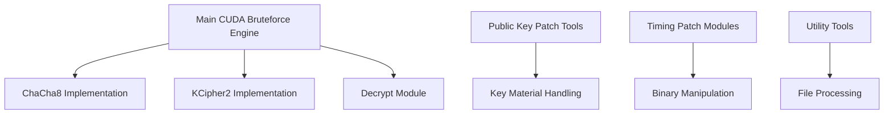

# Akira-Bruteforce Overview

## Introduction to Akira-Bruteforce
- A specialized CUDA-accelerated cryptographic analysis tool designed for the Akira ransomware family
- Core technologies:
  - CUDA/C++ for massively parallel GPU computation
  - ChaCha8 stream cipher (RFC 7539)
  - KCipher2 stream cipher with GPU-optimized implementation
  - SHA-256 for key derivation 
  - AES-256 for post-processing
- Key features:
  - Highly optimized GPU-accelerated cryptographic operations
  - Memory-efficient batch processing
  - Public key manipulation tools
  - Timing analysis infrastructure
  - Configurable search parameters via JSON
- Target users: Security researchers and malware analysts performing cryptographic analysis of Akira ransomware

## Core Design Philosophy

### Performance Optimization
- **GPU-Centric Design**
  - Batch processing of cryptographic operations
  - Shared memory utilization for lookup tables
  - Coalesced memory access patterns
  - Register pressure optimization
  - Minimal host-device transfers

### Architectural Principles
- **Modular Implementation**
  - Isolated cryptographic primitives
  - Clear separation of GPU/CPU workloads
  - Flexible component integration
  - Extensible testing framework

### Memory Management
- **Efficient Resource Utilization**
  - Optimized data structures and alignments
  - Strategic memory allocation/deallocation
  - Minimized memory copies
  - Smart buffering for batch operations

### Security Considerations  
- **Cryptographic Hygiene**
  - Secure key material handling
  - Protected memory operations
  - Validation of cryptographic operations
  - Proper state cleanup

## System Architecture

### High-Level Components


### Core Components

#### 1. CUDA Core Engine
- **Main Processing Engine** (`akira-bruteforce.cu`, `akira-bruteforce.h`)
  - Kernel configuration and launch management
  - Memory transfers and synchronization 
  - Resource allocation and cleanup
  - Error handling and recovery
  - Performance monitoring

#### 2. Cryptographic Modules

##### ChaCha8 Implementation (`chacha8.c`, `chacha8.h`)
```c
struct chacha8_ctx {
    uint32_t input[16];  // State matrix
};

// Core functionality
void chacha8_keysetup(struct chacha8_ctx *x, const uint8_t *k, const uint8_t *iv);
void chacha8_get_keystream_oneblock(const struct chacha8_ctx *ctx, uint8_t *c);
void chacha8_get_keystream(struct chacha8_ctx *x, uint64_t pos, 
                          uint32_t n_blocks, uint8_t *c);
void chacha8_xor_keystream(struct chacha8_ctx *x, uint64_t pos,
                          uint32_t n_blocks, uint8_t *c);
```

##### KCipher2 Implementation (`kcipher2.c`, `kcipher2.h`)
```c
typedef struct {
    unsigned int A[5];   // First register bank
    unsigned int B[11];  // Second register bank
    unsigned int L1, R1; // Left/Right registers 1
    unsigned int L2, R2; // Left/Right registers 2
} kcipher2_state;

typedef struct {
    kcipher2_state state;
    uint64_t remaining;
    char buffer[2000*64];
} kcipher2_stream;
```

#### 3. Public Key Processing (`public-key-patch/`)
- **Key Material Handlers**
  - DER format parsing/encoding
  - ASN.1 structure manipulation
  - Public key modification tools
  - Trailer analysis utilities

#### 4. Timing Analysis Infrastructure
- **Timing Patch Module 1** (`timing-patch-1/`)
  - Code injection framework
  - Function hooking capabilities
  - Runtime patching
  
- **Timing Patch Module 2** (`timing-patch-2/`)
  - Assembly patching engine
  - Timing measurement tools
  - JIT modification support

## Key Components

### Implementation Details

#### ChaCha8 Cipher
- **Purpose**: High-performance stream cipher operations
- **State Management**:
  - 512-bit state matrix (16 × 32-bit words)
  - Constant literals: "expand 32-byte k"
  - 256-bit key (8 words)
  - 64-bit nonce (2 words)
  - 64-bit counter (2 words)

- **Core Operations**:
```c
// Quarter round transformation
#define QUARTERROUND(a, b, c, d) \
    a += b; d ^= a; d = ROTL(d, 16); \
    c += d; b ^= c; b = ROTL(b, 12); \
    a += b; d ^= a; d = ROTL(d,  8); \
    c += d; b ^= c; b = ROTL(b,  7)

// State initialization
void chacha8_init(chacha8_ctx *ctx, const uint8_t *key, const uint8_t *nonce) {
    // Initialize state with constants, key, counter, and nonce
    const uint32_t *k = (const uint32_t *)key;
    ctx->input[ 0] = CHACHA8_CONST_0;
    ctx->input[ 1] = CHACHA8_CONST_1;
    ctx->input[ 2] = CHACHA8_CONST_2;
    ctx->input[ 3] = CHACHA8_CONST_3;
    ctx->input[ 4] = k[0];
    ctx->input[ 5] = k[1];
    ctx->input[ 6] = k[2];
    ctx->input[ 7] = k[3];
    ctx->input[ 8] = k[4];
    ctx->input[ 9] = k[5];
    ctx->input[10] = k[6];
    ctx->input[11] = k[7];
    // Counter (initialized to 0)
    ctx->input[12] = 0;
    ctx->input[13] = 0;
    // Nonce
    ctx->input[14] = U8TO32_LITTLE(nonce + 0);
    ctx->input[15] = U8TO32_LITTLE(nonce + 4);
}
```

#### KCipher2 State Machine
- **Purpose**: Specialized stream cipher with complex state transitions
- **Internal State**:
  - Register Banks:
    - A[5]: Primary feedback shift register
    - B[11]: Secondary feedback shift register
  - Working Registers:
    - L1/R1: First register pair
    - L2/R2: Second register pair

- **Core Operations**:
```c
// Non-linear function
__device__ __forceinline__ unsigned int nlf(unsigned int a, unsigned int b, 
                                          unsigned int c, unsigned int d) {
    return (a + b) ^ c ^ d;
}

// State transition
__device__ void next_INIT(kcipher2_state *state) {
    // Register updates
    unsigned int nL1 = sub_k2(state->R2 + state->B[4]);
    unsigned int nR1 = sub_k2(state->L2 + state->B[9]);
    unsigned int nL2 = sub_k2(state->L1);
    unsigned int nR2 = sub_k2(state->R1);
    
    // Complex state manipulation
    unsigned int nA[5];
    unsigned int nB[11];
    // [State transition logic]
}
```

### Public Key Operations

#### Key Material Processing
- **DER Format Handling**
  ```c
  // Example DER key structure
  struct der_key {
      uint8_t version;      // Key version
      uint8_t algorithm[8]; // Algorithm identifier
      uint32_t key_size;   // Key size in bytes
      uint8_t *key_data;   // Raw key material
      uint8_t padding[8];  // PKCS padding
  };
  ```

#### Trailer Analysis
- **Purpose**: Extract and validate cryptographic metadata
- **Capabilities**:
  - Parse encrypted file trailers
  - Extract key identifiers
  - Validate checksums
  - Process metadata

## Processing Flow

### Pipeline Architecture

#### 1. Input Processing
- **Configuration Loading**
  ```json
  {
    "start_timestamp": 1739876543000000000,
    "count": 1000000,
    "offset": 5000,
    "brute_force_time_range": 10000,
    "matches": [
      {
        "plaintext": "0x0000000000000000",
        "encrypted": "0x1234567890ABCDEF",
        "bitmask": "0xFFFFFFFFFFFFFFFF"
      }
    ]
  }
  ```
- **Resource Initialization**
  - GPU device selection
  - Memory allocation strategy
  - CUDA stream configuration
  - Error handling setup

#### 2. Main Processing Loop
- **Timestamp Generation**
  ```cpp
  void fill_input(uint8_t *h_input, uint64_t start, size_t num) {
      char buffer[20];
      snprintf(buffer, 20, "%019lu", start);
      for (size_t i = 0; i < num; i++) {
          memcpy(h_input + i * 19, buffer, 19);
          // Increment timestamp
          for (int j = 18; j >= 0; j--) {
              if (buffer[j] == '9') {
                  buffer[j] = '0';
              } else {
                  buffer[j]++;
                  break;
              }
          }
      }
  }
  ```

- **GPU Batch Processing**
  ```cpp
  // Kernel launch configuration
  int blockSize = 256;
  int gridSize = (num + blockSize - 1) / blockSize;
  
  // Main processing kernel
  multihash_kernel<<<gridSize, blockSize>>>(d_input, d_output, num);
  
  // Search kernel
  encrypt_and_search<<<gridSize, blockSize>>>(
      d_output, offset, d_found, 
      d_masks, d_matches, matches_size, limit
  );
  ```

#### 3. Result Analysis
- **Match Verification**
  - Parallel pattern matching
  - False positive filtering
  - Result validation

- **Performance Monitoring**
  ```cpp
  uint64_t get_time_in_nanosecond() {
      struct timespec time;
      clock_gettime(CLOCK_MONOTONIC, &time);
      return (uint64_t)time.tv_sec * 1000000000 + 
             (uint64_t)time.tv_nsec;
  }
  ```

### Error Handling Strategy
- **GPU Operations**
  - Kernel launch validation
  - Memory transfer verification
  - Resource allocation checks
  - Device capability validation

- **Cryptographic Operations**
  - State consistency checks
  - Buffer overflow prevention
  - Key material validation
  - Output verification

- **Resource Management**
  - Memory leak prevention
  - CUDA context handling
  - Stream synchronization
  - Error propagation

## Configuration and Customization

### Configuration Schema
```json
{
    "device": {
        "gpu_index": 0,
        "block_size": 256,
        "shared_memory_size": 49152
    },
    "cryptographic": {
        "cipher_mode": "chacha8",
        "key_size": 256,
        "hash_iterations": 1500
    },
    "search": {
        "start_timestamp": "uint64_t",
        "count": "size_t",
        "offset": "size_t",
        "brute_force_range": "size_t"
    },
    "matches": [
        {
            "plaintext": "hex_string",
            "encrypted": "hex_string",
            "bitmask": "hex_string",
            "filename": "string"
        }
    ]
}
```

### Extension Architecture
- **Custom Cipher Integration**
  ```cpp
  // Cipher interface
  struct cipher_interface {
      void (*init)(void *ctx, const uint8_t *key, const uint8_t *iv);
      void (*process)(void *ctx, uint8_t *data, size_t len);
      void (*cleanup)(void *ctx);
  };
  ```

- **Plugin System**
  - Dynamic module loading
  - Hot-swappable components
  - Custom search strategies

### Analysis Tools
- **Performance Profiling**
  - Kernel execution timing
  - Memory transfer analysis
  - Resource utilization tracking

- **State Inspection**
  - Memory dumps
  - State verification
  - Intermediate results

## Integration Options

### Supported Formats
- **Input Formats**
  - Raw binary (.bin)
  - VMDK disk images (.vmdk)
  - Akira encrypted files (.akira)
  - DER encoded keys (.der)

- **Configuration Formats**
  - JSON configuration
  - Binary state dumps
  - Checkpoint files

### Integration Examples

#### Basic Operations
```bash
# Generate random numbers from timestamp
./akira-bruteforce random <count>

# Generate random numbers in GPU
./akira-bruteforce random-gpu <count>

# Test encryption performance
./akira-bruteforce enc <count>

# Run ChaCha8 speed test
./akira-bruteforce chacha8 <count>
```

#### Advanced Usage
```bash
# Run bruteforce with config
./akira-bruteforce run config.json [gpu_index]

# Run optimized bruteforce
./akira-bruteforce run2 config.json [gpu_index]

# Run with offset list
./akira-bruteforce run3 config.json [gpu_index]

# ChaCha8 specific bruteforce
./akira-bruteforce runchacha config.json [gpu_index]
```

#### Utility Operations
```bash
# Save random output to file
./akira-bruteforce saverandom <timestamp>

# Search in random output
./akira-bruteforce search <random.bin> <hex_sequence>
```

## Deployment Architecture

### System Requirements

#### Hardware Requirements
- **GPU Requirements**
  - CUDA Compute Capability ≥ 3.5
  - Minimum 4GB VRAM
  - PCIe 3.0 x16 recommended

- **CPU Requirements**
  - x86_64 architecture
  - AVX2 support recommended
  - 16GB+ system RAM

#### Software Stack
- **Operating System**
  - Linux (primary platform)
  - Kernel version ≥ 4.19
  - CUDA driver ≥ 450.80.02

- **Development Environment**
  - CUDA Toolkit 11.0+
  - GCC/G++ 7.5+
  - CMake 3.10+
  - Python 3.7+ (testing)

### Performance Optimization

#### Memory Management
- **GPU Memory**
  ```cpp
  // Optimized allocation pattern
  template<typename T>
  class gpu_memory_manager {
      T* allocate_pitched(size_t width, size_t height) {
          T* ptr;
          size_t pitch;
          cudaMallocPitch(&ptr, &pitch, width * sizeof(T), height);
          return ptr;
      }
      
      void optimize_transfers(T* src, T* dst, size_t size) {
          cudaMemcpyAsync(dst, src, size, cudaMemcpyDefault);
      }
  };
  ```

- **Batch Processing**
  - Dynamic batch sizing
  - Memory coalescence
  - Pinned memory usage

#### Execution Optimization
- **Kernel Tuning**
  - Thread block optimization
  - Shared memory usage
  - Register pressure management

- **Pipeline Efficiency**
  - Overlap computation/transfer
  - Multi-stream execution
  - Dynamic parallelism

### Monitoring Infrastructure

#### Performance Monitoring
- **Metrics Collection**
  - Kernel execution times
  - Memory transfer rates
  - Resource utilization
  - Throughput tracking

- **Logging System**
  ```cpp
  // Structured logging
  struct performance_log {
      uint64_t timestamp;
      size_t batch_size;
      float kernel_time;
      float transfer_time;
      size_t matches_found;
  };
  ```

#### Error Tracking
- **Error Categories**
  - CUDA runtime errors
  - Memory allocation failures
  - Cryptographic failures
  - Data validation errors

- **Recovery Mechanisms**
  - Checkpoint restoration
  - Graceful degradation
  - Error reporting

## Advanced Topics

### Best Practices

#### Configuration Management
- **Version Control**
  ```bash
  # Configuration tracking
  /configs/
    ├── base.json      # Base configuration
    ├── gpu_opts/      # GPU-specific optimizations
    │   ├── rtx3080.json
    │   └── rtx4090.json
    ├── search/        # Search strategies
    │   ├── chacha8.json
    │   └── kcipher2.json
    └── checkpoints/   # Runtime checkpoints
  ```

- **Documentation Requirements**
  - Configuration changelog
  - Parameter descriptions
  - Optimization rationale
  - Test coverage

#### Performance Optimization
- **GPU Utilization**
  - SM occupancy monitoring
  - Memory bandwidth optimization
  - Cache hit rate tracking
  - Warp efficiency analysis

- **Batch Processing**
  - Dynamic batch sizing
  - Memory transfer optimization
  - Work distribution strategies

#### Security Implementation
- **Key Material Handling**
  ```cpp
  // Secure memory operations
  class secure_memory {
  public:
      static void* allocate(size_t size) {
          void* ptr = mmap(NULL, size, PROT_READ | PROT_WRITE,
                          MAP_PRIVATE | MAP_ANONYMOUS, -1, 0);
          mlock(ptr, size);  // Prevent swapping
          return ptr;
      }
      
      static void deallocate(void* ptr, size_t size) {
          memset(ptr, 0, size);  // Secure wipe
          munlock(ptr, size);
          munmap(ptr, size);
      }
  };
  ```

### Technical Limitations

#### Resource Constraints
- **GPU Memory**
  - Maximum batch size limitations
  - Shared memory restrictions
  - Register pressure bounds

- **Processing Limits**
  - Maximum grid dimensions
  - Block size constraints
  - Atomic operation overhead

#### Platform Dependencies
- **CUDA Requirements**
  - Compute capability limits
  - Driver version constraints
  - API compatibility issues

- **System Dependencies**
  - Library version requirements
  - Kernel feature dependencies
  - Compiler restrictions

### Troubleshooting Guide

#### Common Issues
1. **Compilation Failures**
   ```bash
   # CUDA toolkit verification
   nvcc --version
   
   # System includes
   echo | cuda-gdb -ex 'show debug-file-directory' -ex quit
   
   # Library dependencies
   ldd ./akira-bruteforce
   ```

2. **Runtime Problems**
   - GPU Error Codes
     ```cpp
     // Error checking macro
     #define CUDA_CHECK(call) { \
         cudaError_t err = call; \
         if (err != cudaSuccess) { \
             fprintf(stderr, "CUDA error in %s:%d: %s\n", \
                     __FILE__, __LINE__, \
                     cudaGetErrorString(err)); \
             exit(EXIT_FAILURE); \
         } \
     }
     ```
   
   - Memory Issues
     - Out of memory conditions
     - Memory fragmentation
     - Invalid access patterns

3. **Integration Issues**
   - Format compatibility
   - System permissions
   - Resource conflicts
